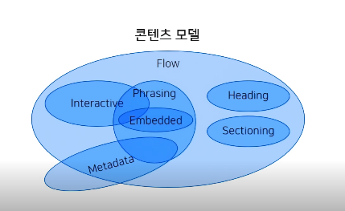

# HTML

HTML/CSS/JS 온라인 에디터 : https://jsfiddle.net/

# 1. HTML 이해하기
## HTML 문법 - `태그(Tag)`

```
<h1> Hello, HTML </h1>

h1 : 태그
<h1> : 시작, 여는 태그
</h1> : 종료, 닫는 태그
Hello, HTML : 내용, 실제 브라우저에 나타나는 부분
<h1> Hello, HTML </h1> : 요소
```
마크업 언어들(XML< SGML, XHTML)은 모두 태그 사용


## HTML 문법 - `속성(Attribute)`

```
<h1 id='title'> Hello, HTML</h1>
< 태그 속성이름='속성값'> : = 제외하고는 어떠한 공백도 들어가서는 안된다.

<h1 id='title' class="test"> Hello, HTML</h1>
< 태그 속성이름='속성값' 속성이름="속성값"> : 하나의 태그에 여러개의 속성 선언 가능, 속성의 선언 순서 상관 없음
```

HTML 태그들은 속성을 가진다.

속성은 태그에 추가적인 정보 제공하고 태그의 동작이나 표현 조절할 수 있는 설정값이다.

속성 = 이름 + 값

속성의 종류 : 
  1. 글로벌 속성, 어느 태그에서나 사용 가능 예) id, class
  2. 특정 속성, 특정 태그에서만 사용 가능
  3. 필수 속성
  4. 선택 속성
  
  
## HTML 문법 - `태그 중첩(Nesting tags)`
```
<h1>Hello. <i>HTML</i></h1> : 올바른 예
<h1>Hello. <i>HTML</h1></i> : 잘못된 예
```
태그 안에 다른 태그 선언 가능하다.

선언되는 태그는 부모 태그에서 벗어나면 안된다.

경우에 따라서 정해진 태그들만 중첩이 가능한 경우가 있다.


## HTML 문법 - `빈 태그(Empty tag)`
```
<br> : 문서 내부적으로 부가적인 정보 제공
 : src 속성을 통해 브라우저에게 이미지의 경로 전달, 브라우저가 내용을 대체해 Replacement태그(대체되어지는 태그)라고도 불리운다.
<input type=''>
```
빈 태그 : 시작태그만 존재, 닫는 태그가 없어서 내용이 없다. 1) 내용만 없을 뿐 속성을 통해서 화면을 나타내거나 2) 화면에 표시되지 않더라도 다른 용도로 사용되는 태그이다.
  - 예: 브라우저가 내용을 직접 그려야 하는 경우에 사용 => 이미지, 비디오와 같은 외부 리소스 삽입하는 경우
  
 
## HTML 문법 - `공백(Space)`
```
<h1>Hello, HTML</h1>
<h1>Hello,     HTML</h1>
<h1>
    Hello,
    HTML
</h1>
```
HTML 한 칸 이상의 공백 모두 무시
 
위 코드의 결과 모두 동일한 결과 나타남
 
 
## HTML 문법 - `주석(Comment tag)`
```
<!-- HTML은 한 칸 이상의 공백을 무시합니다. -->

<h1>
    Hello,
    HTML
</h1>
```
  
## HTML 문서 구조(HTML Documents)
```
<!DOCTYPE HTML> : 이 문서가 어떤 버전으로 작성되었는지 브라우저에게 알려주는 최상단 선언문, <html>태그보다 위에 선언되어야 한다. HTML5로 작성되었다고 선언
<html lang='ko'> : 한국어로 작성된 웹 문서
  <head>
    <meta charset='UTF-8'> : 문자의 인코딩 방식 지정, UTF-8이 가장 기본적인 인코딩 방식
    <title>HTML</title> : 브라우저 탭바에 노출되는 내용
  </head>
  <body>
    <h1>Hello, HTML</h1>
  </body>
</html>
```
- `<!doctype html>` : 문서타입 정의(DTD, doctype), DTD가 없거나 잘못 선언되면 브라우저는 이 문서를 비표준 방식으로 해석한다.
- `<html lang='ko'>`
    - lang : 언어속성, 검색엔진이나 브라우저가 어느 언어로 작성되었는지 알려주는 속성이다.
- `<head> ... </head>` : head 태그에 위치한 태그들은 브라우저 화면에 표시되지 않는다. 문서의 기본정보 설정, 외부 스타일 시트와 JS파일을 연결한다. meta, title, link, style tag 등이 들어간다.
- `<body> ... </body>` : 실제 브라우저 화면에 나타나는 내용들이 담긴다.

# 2. HTML 태그
## HTML 태그

HTML : 태그들의 집합

태그 개수는 130여 개 정도이고 자주 쓰이는 건 대략 25개 정도이다.


## 제목과 단락요소
- `<h1>Hello</h1>` : 제목(Heading) 태그, 문서 내에 제목을 표현할 때 사용, h1~h6까지 존재한다.
- `<p>안녕하세요</p> <p>HTML 학습</p>` : 단락(Paragraph) 태그, 글의 단락을 나타낸다, 블록 레벨
- `<p>HTML 학습 <br> 기록하기</p>` : 개행(Linebreak) 태그, 글의 줄바꿈을 생성한다. <p> 태그 내에서 임의 개행
  
  
## 텍스트를 꾸며주는 요소
택스트 표현 태그, 웹 표준화가 대두하면서 웹 문서의 구조와 표현을 분리. 그 과정에서 많은 표현용 태그들이 사라졌고, 지금은 표현용 태그가 얼마 남지 않음, 인라인 레벨
- `<b>` : 글자에 굵게
- `<i>` : 글자에 이탤릭, HTML5에서 의미를 가지는 태그로 변경. 특정이유로 다른 글자와 구분하기 위해 사용
- `<u>` : 글자에 밑줄
- `<s>` : 글자에 중간선(strike)


## 앵커 요소
앵커(Anchor) 태그 : 링크를 생성하는 태거
-`<a href='http://www.naver.com/' target='_blank'>네이버</a>`
  - `<a>` : a 태그, 앵커 태그, 링크 태그 등으로 불림
  - `href` : a 태그가 가져야 하는 속성 href(hypertext reference), href 속성의 값은 링크의 목적지가 되는 URL
  - `target` : 
  	1. \_self : (기본값)화면 자체를 외부 링크 페이지로 이동 
	2. \_blank : 새로운 창or 탭에 외부 링크 페이지 생성
  - `내부링크` : `<h1 id="some-element-id">회사 소개</h1> `<a herf='#some-element-id> 회사 소개로 이동 </a>`


## 의미가 없는 컨테이너 요소(Container)

의미가 없는 컨테이너 요소 : 별다른 의미없이 다른 목적으로 필요할 때 사용, 순전히 무언가를 담거나 묶기 위해 사용, 의미 있는 태그보다 더 자주 사용.
```
<div>
  <sapn> Lorem </sapn> ipsum dolor sit.
</div>
```
- <div> : division 요소, 블록 레벨 태그 == 모니터 화면의 한줄을 다 채움(블록)
- <span> : span 요소, 인라인 레벨 태그 == 블록 안 요소


## 리스트 요소

- `<ul>` : unordered list, 순서가 없는 리스트

```
<ul>
  <li>콩나물 </li>
  <li>파</li>
  <li>국 간장</li>
</ul>
```
```
output :
ㆍ콩나물
ㆍ파
ㆍ국 간장
```

- `<ol>` : ordered list, 순서가 있는 리스트
```
<ol>
  <li>콩나물 썬다 </li>
  <li>파 썬다</li>
  <li>국 간장 뿌린다</li>
</ol>
```
```
output :
 1. 콩나물 썬다
 2. 파 썬다
 3. 국 간장 뿌린다
```

- `<dl>` : description list, 용어를 설명하는 리스트
- `<dt>` : description term, 용어를 구분한다.
- `<dd>` : definition description, 용어를 정의한다.

```
<dl>
 <dt>리플리 증후군</dt>
 <dd>허구의 세계를 진실이라 믿고 거짓된 말과 행동을 상습적으로 반복하는 반사회적 성격장애를 뜻하는 용어</dd>
 <dd>리플리 증후군에 대한 또 다른 설명은....</dd>
</dl>
```

```
output :
리플리 증후군
  허구의 세계를 진실이라 믿고 거짓된 말과 행동을 상습적으로 반복하는 반사회적 성격장애를 뜻하는 용어
  리플리 증후군에 대한 또 다른 설명은....
```

- 리스트의 중첩
  - `<li>` : ol과 ul 태그만 부모로 가질 수 있다. ol, ul 태그 안에 div, p 태그 올 수 없다. 그러나 li 태그 안에는 div, p 태그가 위치할 수 있다.

```
<h1>
  월드컵 조 편성
</h1>
<ol>
  <li>
    A조
    <ul>
      <li>러시아</li>
      <li>우루과이</li>
      <li>이집트</li>
      <li>사우디아라비아</li>
    </ul>
  </li>
  <li>
    B조
    <ul>
      <li>이란</li>
      <li>스페인</li>
      <li>포르투갈</li>
      <li>모로코</li>
    </ul>
  </li>
  <li>
    C조
    <ul>
      <li>프랑스</li>
      <li>덴마크</li>
      <li>호주</li>
      <li>페루</li>
    </ul>    
  </li>
  <li>
    D조
    <ul>
      <li>크로아티아</li>
      <li>아르헨티나</li>
      <li>아이슬란드</li>
      <li>나이지리아</li>
    </ul>    
  </li>  
</ol>
```

## 이미지 요소
- `` : 문서에 이미지 삽입, 닫는 태그 없는 빈 태그
  - src : 이미지 경로 지정, 필수 옵션
    - 상대 경로 : 웹 문서 페이지를 기준으로 상대적인 이미지 경로. 예: ../ : 상위 폴더로 이동
    - 절대 경로 : 전체 경로
  - alt : 이미지의 대체 텍스트(이미지를 설명하는 글) 지정, 사실상 필수인 옵션, 전달해야하는 정보만 입력하기
  - width/height : 이미지 크기 지정하는 선택 옵션. 사이즈 정해놓으면 더 빠른 이미지 로드 가능. 이미지 크기가 항상 고정적이지 않기 때문에 CSS로 제어한다. 단위 없으면 pixel로 인식. width, height 둘 중에 하나만 변경하면 비율 유지한 상태로 이미지 크기가 변경됨

- 이미지 확장자
  - gif : 256색 제한적, 용량 작고 애니메이션과 투명 이미지 가능
  - jpg : 높은 압축률, 자연스러운 표현 가능, 사진이나 일반적인 그림에 사용, 투명 비지원
  - png : jpg와 비교했을 때 이미지 손실 없고(용량 큼) 투명과 반투명 모두 지원, 요새 웹에서 핫한 이미지 포맷

```
미리보는 CSS
<body stype='background-color: black'> 
```

## 테이블 요소 1

- `<td>`,`<th>` : 데이터 셀
- `<tr>` : 행
- `<table>` : 표

```
<head>
  <style media='screen'>
    td { border: 1px solid; width: 50px; height: 50px}
  </style>
</head>
<table>
  <tr> 
    <td></td><td></td><td></td><td></td>
  </tr>
  <tr> 
    <td></td><td></td><td></td><td></td>
  </tr>
  <tr> 
    <td></td><td></td><td></td><td></td>
  </tr>
  <tr> 
    <td></td><td></td><td></td><td></td>
  </tr>
</table>
```

- `<caption>` : 표의 제목, table의 자식 태그로 table 안에서 가장 먼저 선언되야 한다.
- `<thread>` : 제목 행을 그룹, 제목 행 셀을 나타낼 때는 `<th>` 태그 사용
- `<tfoot>` : 바닥 행을 그룹, 표의 최하단에 표현된다.
- `<tbody>` : 본문 행을 그룹

<head>
  <style media='screen'>
    td { border: 1px solid; width: 50px; height: 50px}
  </style>
</head>
<table>
  <caption>Monthly Saving</caption>
  <thread>
    <tr><th>Month</th><th>Saving</th></tr>
  </thread>
  <tfoot>
    <tr><th>Sum</th><th>180</th></tr>
  </tfoot>
  <tbody>
    <tr><td>Jan</td><td>100</td></tr>
    <tr><td>Feb</td><td>80</td></tr>
  </tbody>
</table>

```
<head>
  <style media='screen'>
    td { border: 1px solid; width: 50px; height: 50px}
  </style>
</head>
<table>
  <caption>Monthly Saving</caption>
  <thread>
    <tr><th>Month</th><th>Saving</th></tr>
  </thread>
  <tfoot>
    <tr><th>Sum</th><th>180</th></tr>
  </tfoot>
  <tbody>
    <tr><td>Jan</td><td>100</td></tr>
    <tr><td>Feb</td><td>80</td></tr>
  </tbody>
</table>
```


테이블 관련 속성
  - colspan : 셀을 가로방향으로 병합
  - rowspan : 셀을 세로방향으로 병합

<head>
  <style media='screen'>
    td { border: 1px solid; width: 50px; height: 50px}
  </style>
</head>
<table>
  <caption>Monthly Saving</caption>
  <thread>
    <tr><th>Month</th><th>Saving</th></tr>
  </thread>
  <tfoot>
    <tr><td colspan='2'>Sum</td></tr>
  </tfoot>
  <tbody>
    <tr><td>Jan</td><td rowspan='2'>100</td></tr>
    <tr><td>Feb</td></tr>
    <tr><td>Mar</td></tr>
  </tbody>
</table>


```
<head>
  <style media='screen'>
    td { border: 1px solid; width: 50px; height: 50px}
  </style>
</head>
<table>
  <caption>Monthly Saving</caption>
  <thread>
    <tr><th>Month</th><th>Saving</th></tr>
  </thread>
  <tfoot>
    <tr><td colspan='2'>Sum</td></tr>
  </tfoot>
  <tbody>
    <tr><td>Jan</td><td rowspan='2'>100</td></tr>
    <tr><td>Feb</td></tr>
    <tr><td>Mar</td></tr>
  </tbody>
</table>
```

## 테이블 요소 2

<head>
  <style media='screen'>
    td { border: 1px solid; width: 50px; height: 50px}
  </style>
</head>
<table>
  <caption>Specification values</caption>
  <thread>
    <tr><th rowspan='2'>Grade</th><th rowspan='2'>Point</th><th colspan='2'>Strength</th><th rowspan='2'>Percent</th></tr>
    <tr>
      <th>kg/mm</th>
      <th>lb/in</th>
    </tr>
  </thread>
  <tbody>
    <tr><td>Hard</td><td>0.45</td><td>56.2</td><td>80,000</td><td>20</td></tr>
    <tr><td>Medium</td><td>0.45</td><td>49.2</td><td>70,000</td><td>25</td></tr>
    <tr><td>Soft</td><td>0.45</td><td>42.2</td><td>60,000</td><td>30</td></tr>
  </tbody>
</table>

```
<head>
  <style media='screen'>
    td { border: 1px solid; width: 50px; height: 50px}
  </style>
</head>
<table>
  <caption>Specification values</caption>
  <thread>
    <tr><th rowspan='2'>Grade</th><th rowspan='2'>Point</th><th colspan='2'>Strength</th><th rowspan='2'>Percent</th></tr>
    <tr>
      <th>kg/mm</th>
      <th>lb/in</th>
    </tr>
  </thread>
  <tbody>
    <tr><td>Hard</td><td>0.45</td><td>56.2</td><td>80,000</td><td>20</td></tr>
    <tr><td>Medium</td><td>0.45</td><td>49.2</td><td>70,000</td><td>25</td></tr>
    <tr><td>Soft</td><td>0.45</td><td>42.2</td><td>60,000</td><td>30</td></tr>
  </tbody>
</table>
```

- <colgroup> : 표의 열을 묶음, https://developer.mozilla.org/ko/docs/Web/HTML/Element/colgroup
- <col> : 열에 속하는 칸에 공통된 의미 부여, https://developer.mozilla.org/ko/docs/Web/HTML/Element/col
  - scope : 컬럼인지 행인지 여부를 알려주는 역할. 스크린 리더기에서 속성값에 따라 어느 순서로 읽을지 결정, 예: `<td scope='row'>1</td>`
- headers : 해당 셀과 연관된 하나 이상의 헤더 셀을 명시, 스크린 리더기와 같은 장치에서 유용
  
  
## 폼 요소 1

폼 요소 : 서버에 데이터를 전달하기 위한 요소

- <input> : 대표적인 폼 요소, 빈 요소, 인라인 레벨, 다양한 type 속성으로 여러 종류의 입력 양식으로 나타난다.
  - placeholder 속성 : 양식 가이드처럼 활용 가능
  - type : text, password, radio(하나 선택하면 이전에 선택한 값은 취소됨, 상호배타적인 항목에서 사용)
    - name 속성 : radio, checkbox에서 같은 성격임을 명시하는 
    - checked 속성 : radio, checkbox에서 사용되며 기본값 지정 하는 속성

```
<h1>Form 관련 요소</h1>
아이디 : <input type="text" placeholder="영문으로 작성요망" /><br><br>
비밀번호 : <input type="password" /><br><br>
동의여부 : 동의 <input name="YesOrNo" type="radio" /> 비동의 <input name="YesOrNo" type="radio" checked/><br><br>
취미 : 운동<input type='checkbox' name='hobby'> 영화감상<input type='checkbox' name='hobby'> 독서<input type='checkbox' name='hobby'> 기타<input type='checkbox' name='hobby' checked>
```

## 폼 요소 2

- `<input type='file'>` : 내 컴퓨터에 있는 파일들을 서버에 올릴 때 사용
- `<input type='submit' value='전송'>` : 제출 버튼을 누르면 값이 서버에 전달된다.
- `<input type='reset' value='취소'>` : 초기화 버튼을 누르면 값을 초기상태로 변경한다.
- `<input type='button' value='등록'>` : 기본 동작 없어 개발자가 기능을 추가해야한다.
- `<input type='image' value='등록'>` : submit과 동일한 기능, 버튼 모양에 이미지 삽입이 가능하다.

```
<form action="/test.html"></form>

<h1>Form 관련 요소</h1>
<p>아이디 : <input type="text" placeholder="영문으로 작성요망" /><br /><br />
  비밀번호 : <input type="password" /><br /><br />
  동의여부 : 동의 <input name="YesOrNo" type="radio" />
  비동의 <input checked="checked" name="YesOrNo" type="radio" /><br /><br /> 
  취미 : 운동<input name="hobby" type="checkbox" /> 영화감상<input name="hobby" type="checkbox" /> 독서<input name="hobby" type="checkbox" /> 기타<input checked="checked" name="hobby" type="checkbox" /><br /><br />
  프로필 사진 업로드 :  <input type="file" /><br><br>  
  <input type='submit' value='전송'><br><br>
  <input type='reset' value='취소'><br><br>
  <input type='button' value='등록'><br><br>
  <input type='image' src='https://image.shutterstock.com/z/stock-vector-login-button-login-sign-key-push-button-1725108469.jpg' alt='로그인' height='100'>
</p>
```


## 폼 요소 3

- SELECT 요소 : 선택 목록 상자, 콤보박스라고도 한다.
- `<option selected>제주</option>` : selected는 기본 값을 지정한다.

```
사는 지역 : <select>
<option>서울</option>
<option>경기</option>
<option>강원</option>
<option selected>제주</option>
</select>
```

- TEXTAREA 요소 : 사용자에게 여러 줄의 텍스트를 입력받고자 할 때 사용한다.
  - cols 속성 : 한 줄에 표현되는 글자 수 (영문기준)
  - rows : 한 번에 보여질 글자의 라인 수
  - `<input type = 'text'> : 한 줄만 입력 가능하다.

```
자기소개 : <textarea cols="30" rows="5" placeholder="자기소개는 짧게 해주세요"></textarea>
```

- BUTTON 요소 : 사용자가 클릭 가능한 버튼을 생성한다. type 속성 값에 따라 동작한다.

```
<button type='submit'>제출하기</button>
<button type='reset'>초기화하기</button>
```


## 폼 요소 4

- LABEL 요소 : 폼 요소와 연결하여 웹 전급성 향상에 도움이 되어 필수적으로 선언하자.

```
<label for='userid'>아이디 :</label>
<input type="text" placeholder="영문으로 작성요망" id='userid'/><br><br>
<label for='password'>비밀번호 :</label><input type="password" id='password'/><br><br>
동의여부 : <label for='pros'>동의</label> <input name="YesOrNo" type="radio" id='pros' />
<label for='cons'>비동의</label><input checked="checked" name="YesOrNo" type="radio" id='cons'/>
```
아이디와 입력요소 연결되어서 아이디 : 레이블을 클릭하면 입력요소에 |가 생긴다.


- FIELDSET 요소 : 폼 요소를 그룹화해주는 태그
- LEGEND 요소 : fieldset 태그로 묶인 그룹의 이름을 지정해주는 태그, fieldset 안에서 가장 먼저 등장해야한다.

```
<fieldset>
  <legent>기본 정보</legent><br><br>
  
 <label for='userid'>아이디 :</label>
  <input type="text" placeholder="영문으로 작성요망" id='userid'/><br><br>
  <label for='password'>비밀번호 :</label><input type="password" id='password'/><br><br>
  동의여부 : <label for='pros'>동의</label> <input name="YesOrNo" type="radio" id='pros' />
  <label for='cons'>비동의</label><input checked="checked" name="YesOrNo" type="radio" id='cons'/>
</fieldset>

<fieldset>
  <legent>부가 정보</legent><br><br>
  취미 : 운동<input name="hobby" type="checkbox" /> 영화감상<input name="hobby" type="checkbox" /> 독서<input name="hobby" type="checkbox" /> 기타<input checked="checked" name="hobby" type="checkbox" /><br><br>
  프로필 사진 업로드 :  <input type="file" /><br><br>  
  <input type='submit' value='전송'><br><br>
  <input type='reset' value='취소'><br><br>
  <input type='button' value='등록'><br><br>
</fieldset>
```

- FORM 요소 : 폼 데이터를 그룹화하여 서버에 전송한다.
  - action : 폼 데이터를 처리하기 위한 서버의 주소
  - method : 데이터를 전송하는 방식을 지정(get, post)
    - get : 전송한 값이 URL에 붙어서 전송해도 될 때 사용
    - post : 민감정보(회원정보, 로그인)를 서버에 전송할 때 사용

폼 요소는 서버 개발자가 주로 다룬다.

```
  <form action='result.html' method='get'>
  <fieldset>
  <legent>기본 정보</legent><br><br>
    <label for='userid'>아이디 :</label>
  	<input type="text" placeholder="영문으로 작성요망" id='userid'/><br><br>
  	<label for='password'>비밀번호 :</label><input type="password" id='password'/><br><br>
    <input type='submit' value='전송'><br><br>
 </fieldset>
</form>
```

전체 실습 코드 
```
<!DOCTYPE html>
<html lang="ko">
<head>
	<meta charset="UTF-8">
	<title>form</title>
</head>
<body>
	<form action="">
		<h1>Form 관련 요소</h1>
		<fieldset>
			<legend>기본 정보</legend>
			<label for="userid">아이디 : </label> <input type="text" placeholder="영문으로만 써주세요" id="userid"><br>
			<label for="userpw">비밀번호 : </label> <input type="password" id="userpw"><br>
			성별 : <label for="male">남자</label> <input type="radio" name="gender" id="male" checked>, <label for="female">여자</label> <input type="radio" name="gender" id="female"><br>
		</fieldset>
		<fieldset>
			<legend>부가 정보</legend>
			취미 : 영화 감상 <input type="checkbox" name="hobby" checked>, 음악 감상 <input type="checkbox" name="hobby">, 독서 <input type="checkbox" name="hobby"><br>
			프로필 사진 업로드 : <input type="file"><br>
			사는 지역 : <select>
				<option>서울</option>
				<option>경기</option>
				<option>강원</option>
				<option selected>제주</option>
			</select><br>
			자기소개 : <textarea cols="30" rows="5" placeholder="자기소개는 짧게 해주세요."></textarea><br>
			<button type="submit">전송</button>
			<button type="reset">취소</button>
		</fieldset>
	</form>
</body>
</html>
```

# 3. 콘텐츠모델, 시멘틱마크업, 블록 
## 콘텐츠 모델



Content Models 의 7 분류  

- Metadata Content
- Flow Content
- Sectioning Content
- Heading Content
- Phrasing Content
- Embedded Content
- Interacitve Content


1. Metadata 

	- " base,
 link, 
meta,
 noscript,
 script,
 style,
 title "
	- Metadata에는 콘텐츠의 스타일, 동작을 설정하거나 다른 문서와의 관계 등 정보를 포함하는 요소들이 포함됩니다.
	- 메타 태그, 타이틀 태그, 스타일 태그, 링크 태그가 이에 해당하며 대부분 `<head>`내에 들어간다는 것이 특징입니다.

 
2. Flow 

	- " a, abbr, address,
map>area, article, aside,
audio, b, bdo, blockquote,
br, button,
	canvas, cite, code, datalist, del, details, dfn, div, dl, em, embed,
	fieldset, figure, footer, form, h1 ~ h6, header, hgroup, hr, i, iframe, img,
	 input, ins, kbd, keygen, label, map, mark, math, menu, meter, nav, noscript, object, ol,
	output, p, pre, progress, q, ruby, samp, script, section, select, small, span, strong,
	style[scoped], sub, sup, svg, table, textarea, time, ul, var, video, wbr "   
	- Flow에는 문서의 자연스러운 흐름에 의해 배치되는 요소들이 포함됩니다.  
	- Metadata에 해당하는 일부 태그들만 Flow에서 제외되며 `요소 대부분이 Flow에 포함됩니다.` 

 
3. Sectioning 
	- " article, aside, nav, section " 
	- Sectioning에는 `문서의 구조와 관련된 요소`들이 포함됩니다.
	- `HTML5에서 새로 생긴 <article>, <aside>, <nav>, <section>` 등이 포함되며 이 태그들은 문서의 구조, 아웃라인에 영향을 주게 됩니다.

 
4. Heading 
	- " h1, h2, h3, h4, h5, h6 " 
	- Heading에는 각 section의 header를 정의하는 heading 태그가 포함됩니다.


5. Phrasing 
	- "a, abbr, map>area, audio, b, bdo, br, button, canvas, cite, code, datalist, del, dfn, em, embed,
	 i, iframe, img, input, ins, kbd, keygen, label, map, mark, math, meter, noscript, object, output,
	 progress, q, ruby, samp, script, select, small, span, strong, sub, sup, svg, textarea, time,
	var, video, wbr"
	- Phrasing에는 문서의 `텍스트 또는 텍스트를 꾸며주는 문단 내부 레벨`로 사용되는 요소들이 포함됩니다.


6. Embedded 
	- " audio,
 canvas,
 embed,
 iframe,
 img,
 math,
 object,
 svg,
 video " 
	- Embedded에는 `외부 콘텐츠를 표현하는 요소들`이 포함되며 오디오나 비디오, 이미지 등 멀티미디어 관련 요소들이 이에 해당합니다.
	- 임베디드 모델은 모두 프레이징 모델이다.


7. Interactive 
	- " a, audio[controls], button, details, embed, iframe, img[usemap], input, keygen, label, menu,
	object[usemap], select, textarea, video[controls] " 
	- Interactive에는 사용자와 상호작용을 하는 요소들이 포함되며 대표적으로 form 요소들이 이에 해당합니다.


## 시멘틱 마크업

시멘틱은 즉, 기계(컴퓨터, 브라우저)가 잘 이해할 수 있도록 하는 것을 뜻합니다.

시맨틱 마크업 : 컴퓨터(브라우저)가 잘 이해할 수 있는 코드
- 의미에 맞는 요소 사용
- 문서의 구조화
- 인간과 기계 모두 이해할 수 있는 것이 목표

시멘틱 마크업은 적절한 HTML 요소를 올바르게 사용하는 것에서 시작합니다.

```
<b>굵은</b> vs <strong>중요한</strong>
: 글씨 굵게 vs 글씨 중요 => 중요하다는 의미를 가지고자 할때는 strong 태그를 사용하면 시멘틱한 마크업을 사용한 것이다.

<i>기울어진</i> vs <em>강조하는</em>
<u>밑줄친</u> vs <ins>새롭게 추가된</ins>
<s>중간선이 있는</s> vs <del>삭제된</del>
```

## HTML5 시멘틱 요소

HTML5에서 새로 생긴 Sematic 요소들입니다.

```
<article>
<aside>
<figcaption>
<figure>
<footer>
<header>
<main>
<mark>
<nav>
<section>
<time>
```
예제 코드 링크 : https://developer.mozilla.org/en-US/docs/Glossary/Semantics


## 블록&인라인

블록 vs 인라인 : 시각적 차이 존재

1. 블록 레벨 요소 : 한 줄에 하나의 요소 표시

부모 요소의 가로 영역에 맞게 꽉 채워져 표현되는 요소입니다.
`양옆으로 다른 요소가 배치되지 않게 박스를 생성`하므로 박스의 위아래로 `줄 바꿈`이 생기게 됩니다.
블록 레벨 요소는 일반적인 모든 요소(블록, 인라인 레벨 등)를 포함할 수 있습니다. 

	예 : div, h1~h6, p, ul, li, table ...


2. 인라인 레벨 요소 : 한 줄에 여러개의 요소 표시

하나의 라인 안에서 `자신의 내용만큼의 박스`를 만드는 요소입니다.
라인의 흐름을 끊지 않고 요소 앞 뒤로도 줄 바꿈이 되지 않아 다른 인라인 요소들이 자리할 수 있습니다.
`인라인 레벨 요소는 블록 레벨 요소의 자식으로 분류`되기 때문에 `자손으로 블록 레벨 요소를 가질 수 없습니다.`
`즉, 인라인 레벨 요소는 블록 레벨 요소를 포함할 수 없습니다.`

	예 : " span, i, img, em, strong, a ...

다만, HTML5 버전에서 생겨난 한가지 예외 경우가 있는데 `<a>는 인라인 레벨 요소지만 자손으로 블록 레벨 요소를 가질 수 있습니다.`
