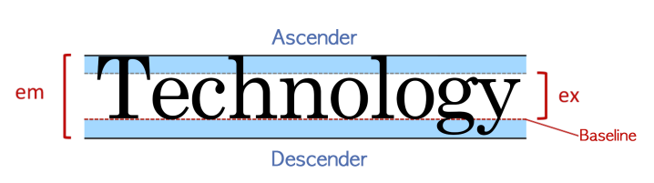

# 폰트, 텍스트
## 1) 속성-typography



모든 폰트는 em박스를 가지고 있고 위 그림과 같은 구조로 이루어져 있다.

- em 폰트의 전체 높이를 의미한다.
- ex ( = x-height ) 해당 폰트의 영문 소문자 x의 높이를 의미한다.
- Baseline 소문자 x를 기준으로 하단의 라인을 의미한다.
- Descender 소문자에서 baseline 아래로 쳐지는 영역을 의미한다. 서체에 따라 descender의 길이가 다르다. ( g, j, p, q, y )
- Ascender 소문자 x의 상단 라인 위로 넘어가는 영역을 의미한다. ( b, d, h, l )


## 2) 속성-font-family

font-family: family-name | generic-family ( | initial | inherit );

```css
font-family: Helvetica, Dotum, '돋움', Apple SD Gothic Neo, sans-serif; 
```

- family-name: 사용할 폰트의 이름을 나타내며 ' , ' 로 구분하여 여러 개 선언 할 수 있다. 먼저 선언된 순서대로 우선순위가 결정된다. 이름 중간에 공백이 있거나, 한글일 경우 홑따옴표로 묶어서 선언한다.

- generic-family: family-name으로 지정된 글꼴을 사용할 수 없을 경우를 대비해, `브라우저가 대체할 수 있는 폰트가 필요한 경우 선택할 수 있게 해준다.` `font-family 속성의 맨 마지막에 선언해야 하며`, 키워드이기 때문에 따옴표 등의 인용부호로 묶지 않는 것이 원칙이다. 예를 들면 아래와 같이 선언하여 사용할 수 있다. generic-family는 브라우저의 폰트 지원율이 좋게 하기 때문에 중요하다.
  - serif(삐침) : 삐침이 있다. 명조, 바탕체 계열
  - san-serit(삐침없는) : 삐침이 없다. sans는 프랑스어로 without을 뜻한다. 돋움체 계열
  - monospace : 글자의 가로세로가 같아 가독성이 좋은 글자체
  - cursive, fantasy : 꾸밈있는 글자체


## 3) 속성-line-height


line-height 속성

line-height: normal | number | length | initial | inherit ;
- 텍스트 라인의 높이를 의미하는 것으로 주로 행간을 제어할 때 사용한다. 
- 기본값 : normal
- 숫자와 %만큼 배율로 적용 가능하다
- px, em 등 고정 수치로 할당할 수 있다.
  - 모바일에서 글자 크게 보기 할 때 행간이 잘려서 나온다면 행간이 px로 되어있을 가능성이 높다.
- https://developer.mozilla.org/en-US/docs/Web/CSS/line-height

## 4) 속성-font-size
```css
font-size: keyword | length | initial | inherit ;
```
- 글꼴의 크기를 지정하는 속성이다.
- 실무에서는 브라우저마다 동일한 화면을 제공해야 하기 때문에 절대적인 폰트 크기를 사용하지 않는다.
- 폰트 크기 미지정 시 기본 크기는 16px(1em)이다.
- 기본 값은 medium이다.
  - keyword medium(기본 값), xx-small, x-small, small, large, x-large, xx-large, smaller, larger
  - length : px, em 등 고정 수치로 지정한다.
  - % : 부모 요소의 font-size 기준의 퍼센트로 지정한다.
- https://developer.mozilla.org/ko/docs/Web/CSS/font-size

absolute size (keyword) 기본 값인 medium에 대한 상대적인 크기로, 브라우저마다 사이즈가 다르게 정의되었다.

relative size (keyword) 부모 요소의 font-size 크기에 대해 상대적이다. smaller는 0.8배, larger는 1.2배이다.

length px, em, rem 등의 단위를 이용하여 고정된 크기를 지정할 수 있다.
- em :  부모 요소의 font-size에 em 값을 곱한 크기 
- rem : 루트의 font-size에 rem 값을 곱한 크기이다.

percent (%) 부모 요소의 font-size를 기준으로 백분율 계산된 값을 지정할 수 있다.

viewport units vw, vh 단위로 뷰포트를 기준으로 하여, 유동적인 font-size를 지정할 수 있다. 

vw는 뷰포트 width의 1%, vh는 뷰포트 height의 1% 값을 가진다.


## 5) 속성-font-weight

```css
font-weight: normal | bold | bolder | lighter | number | initial | inherit ;
```
font-weight : 글꼴의 굵기를 지정하는 속성

- normal : 기본 값 (400)
- bold : 굵게 표현(700)
- bolder : 부모 요소 보다 두껍게 표현
- lighter : 부모 요소 보다 얇게 표현

    실무에서 normal과  bold를 많이 사용, 부모 요소에 영향이 있는 bolder와 lighter는 사용을 될 수 있으면 지양한다.

    상속 관계에서 바뀌어야 하는 스펙이라면 당연히 유용하게 사용할 수 있지만, 그 외의 경우에는 사용에 있어 신중해야 한다.

- number : 100, 200, 300, 400, 500, 600, 700, 800, 900 (클수록 더 두껍게 표현)

    font-weight는 normal, bold와 같은 키워드 외에 숫자로도 그 굵기를 표현할 수 있다.

    100~900까지 100단위로 값을 지정하여 사용할 수 있고 숫자가 커질수록 더욱 굵게 표현된다.

    기본적으로 400은 normal과 같고, 700은 bold와 같다. 그러나 `수치를 이용한 font-weight는 폰트 자체에서 지원을 해야 표현할 수 있다.`

    폰트에 따라 font-weight를 적용해도 굵기에 변화가 없을 수도 있으며, `normal과 bold만 지원하는 폰트일 경우에는 100~500까지는 normal로, 600~900까지는 bold로 표현됩니다.`

폰트가 점차 다양해지면서 `굵기 자체를 폰트 family-name으로 가지고 있는 경우도` 있다.

또한,  디바이스별로 조금 다르게 표현될 수도 있다. 

font-weight와 font-family, font-size는 서로 밀접하게 연관되어있다.
- 폰트 패밀리 자체가 사이즈가 커지면 조금 더 굵게 표현하기 때문에 그럴 때 수치를 조금 크게 조정한다.

https://developer.mozilla.org/ko/docs/Web/CSS/font-weight

```html
<!DOCTYPE html>
<html lang="ko">
<head>
  <meta charset="UTF-8">
  <title>font-size</title>
  <link href='//fonts.googleapis.com/css?family=Open+Sans:400,600,700,800,300' rel='stylesheet' type='text/css'>
  <style>
    body {
       padding: 0 20px;   
       font-family: 'Open Sans';
    }
    .w100 { font-weight: 100; }
    .w200 { font-weight: 200; }
    .w300 { font-weight: 300; }
    .w400 { font-weight: 400; }
    .w500 { font-weight: 500; }
    .w600 { font-weight: 600; }
    .w700 { font-weight: 700; }
    .w800 { font-weight: 800; }
    .w900 { font-weight: 900; }
  </style>
</head>
<body>
  <p class="w100">This is 100 weight</p>
  <p class="w200">This is 200 weight</p>
  <p class="w300">This is 300 weight (available)</p>
  <p class="w400">This is 400 weight (available)</p>
  <p class="w500">This is 500 weight</p>
  <p class="w600">This is 600 weight (available)</p>
  <p class="w700">This is 700 weight (available)</p>
  <p class="w800">This is 800 weight (available)</p>
  <p class="w900">This is 900 weight</p>
</body>
</html>
```

## 6) 속성-font-style

```css
font-style: normal | italic | oblique | initial | inherit;
```

font-style : 글꼴의 스타일을 지정하는 속성
- normal : font-family 내에 분류된 `기본 값`.
- italic : italic 스타일로 표현한다. `<em>` 태그로 강조할 때 사용하는 기본 글자체가 이탤릭체이다.
- oblique : oblique 스타일로 표현한다. oblique 텍스트의 기울기에 대한 각도를 추가로 지정할 수 있다.
  - 유효한 값은 -90 ~ 90도이며, 따로 각도를 지정하지 않으면 14도가 사용된다. 양수 값은 글의 끝 부분 쪽으로 기울어지며, 음수값은 시작 부분 쪽으로 기울어집니다. 그러나 아직 초안 단계로 CSS Fonts Module Level 4를 지원하는 브라우저에서만 사용 가능하다.
https://developer.mozilla.org/en-US/docs/Web/CSS/font-style

## 7) 속성-font-variant
```css
font-variant: normal | small-caps | initial | inherit ;
```
font-variant : 글꼴의 형태를 변형하는 속성으로 소문자를 작은 대문자로 변환할 수 있다.
- normal : 기본 값
- small-caps : 소문자를 작은 대문자로 변형한다.

```html
<!DOCTYPE html>
<html lang="ko">
<head>
  <meta charset="UTF-8">
  <title>font-variant</title>
  <style>
    p {
      font-variant: small-caps;
    }
  </style>
</head>

<body>
  <p>Font-Variant: Small-Caps</p>
</body>
</html>
```

## 8) 속성-font

```css
font: font-style font-variant font-weight font-size/line-height font-family | initial | inherit;
```
font : font-style, font-variant, font-weight, font-size/line-height, font-family 속성들을 한 번에 선언할 수 있는 축약형 속성이다. 실무에서 지양하는 속성이다.
- 기본 값 : 각 속성들의 기본 값
- font-style : font-style 지정, 기본 값은 normal
- font-variant : font-variant 지정, 기본 값은 normal
- font-weight : font-weight 지정, 기본 값은 normal
- font-size/line-height : font-size/line-height 지정, 기본 값은 normal
- font-family : font-family 지정

축약형을 선언할 때는 아래 사항들을 유의해야 한다. => 지켜야 할 룰이 많아서 폰트 축약형을 선호하지 않는다.
- `font-size와 font-family는 반드시 선언해야 하는 필수 속성`이다.
- 빠진 속성이 있다면 기본 값으로 지정된다.
- `각 속성의 선언 순서를 지켜야 한다.`

```css
/* style | size | family */
font: oblique 2em "돋움", dotum, sans-serif;

/* style | variant | weight | size/line-height | family */
font: oblique small-caps bold 16px/1.5 '돋움';

/* The font used in system dialogs */
font: message-box;
font: icon;
```

## 9) 속성-webfont

@font-face : 웹에 있는 글꼴을 사용자의 로컬 환경(컴퓨터)으로 다운로드하여 적용하는 속성이다. 
- `기본 값 없음`
- font-family(필수) : 글꼴의 이름을 지정
- src(필수) : 다운로드 받을 글꼴의 경로(URL)
- font-style(옵션) : 글꼴의 스타일 지정, 기본 값은 normal
- font-weight(옵션) : 글꼴의 굵기 지정, 기본 값은 normal

시스템 폰트 : 폰트 패밀리로 선언한 그 글꼴이 선택되는 경우 시스템 상에서 제공되는 값을 그대로 바꿀 수 있는 폰트를 통칭한다.

이미지 폰트 : 이미지를 잘라서 제공하는 폰트를 의미한다.

웹 폰트 : 아예 다른 글꼴을 서버에 저장해서 제공하거나 혹은 웹 경로를 가져와서 import 해서 제공하는 폰트 혹은 사용자의 로컬 환경에 글꼴을 다운로드 받아 적용하는 것이다. 포털에서 제공하거나 경로를 따라서 제공한다.

설치형 폰트 : 나눔 고딕

```css
@font-face {
    font-family: webNanumGothic; /* 사용자 지정 웹 폰트명 */
    src: url(NanumGothic.eot); /* 적용 될 웹 폰트의 경로 */
    font-weight: bold; /* 필요에 따라 지정 */
    font-style: italic; /* 필요에 따라 지정 */
}

body {
    font-family: webNanumGothic;
}
```

웹폰트는 선언 시 필요에 따라 굵기나 스타일 등을 같이 지정해서 사용할 수 있다.
https://web.dev/fast/#optimize-webfonts
https://wit.nts-corp.com/2017/02/13/4258

## 10) 속성-vertical-align

```css
vertical-align: keyword | length | percent | initial | inherit ;
```
vertical-align : 요소의 수직 정렬을 지정하는 속성이다.
- length : 요소를 지정한 길이만큼 올리거나 내림. 음수 허용
- % : 요소를 line-height를 기준으로 올리거나 내림. 음수 허용
- keyword : baseline(기본 값==0px), sub, super, top, text-top, middle, bottom, text-bottom

vertical-align 속성은 인라인요소 또는 테이블 셀 상자의 수직 정렬을 지정할 때 사용한다. 대부분 부모요소에 상대적으로 정렬된다.
- 텍스트는 인라인 요소라서 폰트 패밀리, 폰트 사이즈, LINE-HEIGHT 등의 많은 영향을 받는다.

https://www.w3schools.com/cssref/pr_pos_vertical-align.asp

```html
<!DOCTYPE html>
<html lang="ko">
<head>
  <meta charset="UTF-8">
  <title>vertical-align</title>
  <style>
    p {
      padding: 10px;
      border: 1px dashed #aaa;
      line-height: 1;
      font-size: 16px;
    }

    p span {
      background-color: rgba(0, 255, 255, 0.5);
      border: 1px solid #aaa;
    }

    p span:nth-child(1) {
      background-color: rgba(255, 255, 0, 0.5);
    }

    p span:nth-child(2),
    p span:nth-child(4) {
      font-weight: bold;
      font-size: 20px;
    }

    p span:nth-child(3) {
      background-color: rgba(0, 0, 0, 0.2);
    }

    /* table */

    table {
      width: 100%;
      border-collapse: collapse;
    }

    table td,
    table th {
      border: 1px solid #aaa;
      height: 50px;
    }
  </style>
</head>
<body>
    <h1>vertical-align</h1>
    <p><span>vertical-align:</span>
      <span style="vertical-align: baseline;">baseline;</span>
      <span>---</span>
      <span style="vertical-align: baseline;">수직정렬</span></p>
    <p><span>vertical-align:</span>
      <span style="vertical-align: sub;">sub;</span>
      <span>---</span>
      <span style="vertical-align: sub;">수직정렬</span></p>
    <p><span>vertical-align:</span>
      <span style="vertical-align: super;">super;</span>
      <span>---</span>
      <span style="vertical-align: super;">수직정렬</span></p>
    <p>
      <span>vertical-align:</span>
      <span style="vertical-align: text-top;">text-top;</span>
      <span>---</span>
      <span style="vertical-align: text-top;">수직정렬</span></p>
    <p><span>vertical-align:</span>
      <span style="vertical-align: text-bottom;">text-bottom;</span>
      <span>---</span>
      <span style="vertical-align: text-bottom;">수직정렬</span></p>
    <p><span>vertical-align:</span>
      <span style="vertical-align: middle;">middle;</span>
      <span>---</span>
      <span style="vertical-align: middle;">수직정렬</span></p>
    <p><span>vertical-align:</span>
      <span style="vertical-align: top;">top;</span>
      <span>---</span>
      <span style="vertical-align: top;">수직정렬</span></p>
    <p><span>vertical-align:</span>
      <span style="vertical-align: bottom;">bottom;</span>
      <span>---</span>
      <span style="vertical-align: bottom;">수직정렬</span></p>
    <p><span>vertical-align:</span>
      <span style="vertical-align: 4em;">4em;</span>
      <span>---</span></p>
    <p><span>vertical-align:</span>
      <span style="vertical-align: 4px;">4px;</span>
      <span>---</span></p>
    <p><span>vertical-align:</span>
      <span style="vertical-align: 20%;">20%;</span>
      <span>---</span></p>
    <p><span>vertical-align:</span>
      <span style="vertical-align: -10px;">-10px;</span>
      <span>---</span></p>

    <table>
      <caption>table cell vertical-align</caption>
      <thead>
        <tr>
          <th>속성 값</th>
        </tr>
      </thead>
      <tbody>
        <tr>
          <td style="vertical-align:baseline;">vertical-align:baseline</td>
        </tr>
        <tr>
          <td style="vertical-align:top;">vertical-align:top</td>
        </tr>
        <tr>
          <td style="vertical-align:middle;">vertical-align:middle(cell 기본값)</td>
        </tr>
        <tr>
          <td style="vertical-align:bottom;">vertical-align:bottom</td>
        </tr>
        <tr>
          <td>null</td>
        </tr>
      </tbody>
    </table>
</body>
</html>
```

## 11) 속성-text-align
```css
text-align: left | right | center | justify | initial | inherit ;
```

text-align : 텍스트의 정렬을 지정하는 속성이다. 블록 요소 안에서 텍스트 인라인 요소들이 정렬된다.
- left : 텍스트를 왼쪽으로 정렬, 기본값
- right : 텍스트를 오른쪽으로 정렬, 아랍어와 같은 Right to Left 언어일 경우 right이 기본값이다.
- center : 텍스트를 중앙으로 정렬
- justify : 텍스트를 라인 `양쪽 끝`으로 붙여서 정렬 (마지막 라인은 정렬 하지 않음)

### text-align과 display의 관계
- text-align은 `inline-level에 적용`
  - div의 자식 요소인 텍스트는 인라인 레벨이다.   
- text-align은 `block-level에 적용할 수 없음`

block 요소를 가운데 정렬 할 때 : 박스모델 챕터에서 다룬 margin의 auto 값을 이용한다. 
- 가운데 정렬 인라인 요소 : text-align (center) 블럭 요소 :  margin (auto) 

요소의 레벨에 따라 정렬하는 방식의 차이를 바르게 알고 있어야 한다.

```html
<!DOCTYPE html>
<html lang="ko">
<head>
  <meta charset="UTF-8">
  <title>text-align</title>
  <style>
    div{
      width: 100px;
      height: 100px;
      background: red;
    
      /* 블록 레벨 요소 가운데 정렬 */
      margin: 0 auto;
      
      /* 인라인 레벨 요소 가운데 정렬 */
      text-align: center;
    }
  </style>
</head>
<body>
  <div>box</div>
</body>
</html>
```

## 12) 속성-text-indent

```css
text-indent: length | initial | inherit;
```

text-indent : 텍스트의 들여쓰기를 지정하는 속성, 상속 가능
- length : px, em 등 고정 수치로 지정. 음수 허용
  - length 문단의 첫 줄에 대한 들여쓰기를 수행한다. 음수 값을 사용할 수 있으며, 음수 값 사용 시 왼쪽으로 이동한다.
- % : 부모 요소의 width를 기준으로 퍼센트로 지정
  - percent(%) 텍스트를 포함하는 컨테이너 블록의 width(부모의 width)를 기준으로 변환된 백분율 값으로 들여쓰기한다.

```html
<p style="text-indent: 1em;">이 안내서를 시작하기 전에, 사용법에 익숙한 텍스트 파일을 편잡할 수 있는 편집 툴이 필요하며 최신 브라우저도 필요하다. 파일을 편집하고 싶지 않다면 그냥 안내서를 읽고 해당 예시 그림을 보라. 그러나 배우는데는 더딜 것이다.</p>
```

https://www.w3schools.com/cssref/pr_text_text-indent.asp


## 13) 속성-text-decoration
```css
text-decoration: text-decoration-line text-decoration-color text-decoration-style | initial | inherit;
```
text-decoration : 텍스트의 장식을 지정하는 속성이다. 아래 속성들의 단축 속성으로, 기본 값은 차례대로 none, currentColor, solid 3가지 속성의 값이다. 선은 텍스트에 의존해서 상세한 픽셀 값은 이 속성값으로는 조정이 불가능해 다른 CSS 속성을 사용해야 한다.

text-decoration-line : 텍스트 꾸밈의 종류를 지정하는 속성이다.
- none : 텍스트 꾸밈을 생성하지 않음, 기본값
- underline : 밑줄로 꾸밈을 설정
- overline : 윗줄로 꾸밈을 설정
- line-through : 중간을 지나는 줄로 꾸밈을 설정

text-decoration-color : 텍스트 꾸밈의 색상을 지정하는 속성이다.   
- currentColor : 기본 값, 색상 값을 사용하여 원하는 색상을 지정할 수 있습니다.

text-decoration-style : 꾸밈에 사용되는 선의 스타일을 지정하는 속성이다.    
- solid : 기본값, 한줄 스타일
- double : 이중선 스타일
- dotted : 점선 스타일
- dashed : 파선 스타일
- wavy : 물결 스타일


```html
<!DOCTYPE html>
<html lang='ko'>
<head>
  <style>
    h1 {
      text-decoration: overline;
    }
    h2 {
      text-decoration: line-through;
    }
    h3 {
      text-decoration: underline;
    }
    h4 {
      text-decoration: underline overline;
    }
  </style>
</head>
<body>
  <h1>This is heading 1</h1>
  <h2>This is heading 2</h2>
  <h3>This is heading 3</h3>
  <h4>This is heading 4</h4>
</body>
</html>
```

## 14) 속성-단어 관련 속성

아래 속성들은 실무에서 자주 쓰인다.

박스 모델이나 레이아웃 관련 속성들은 상속이 잘 안되는 반면 폰트나 텍스트 관련된 속성들은 상속이 많이 되는 편이다.

### white-space 속성

```css
white-space: normal | nowrap | pre | pre-line | pre-wrap | initial | inherit;
```
white-space : 요소 안에 공백을 어떻게 처리할지 지정하는 속성
- normal : 공백과 개행을 무시하고, 필요한 경우에 자동 줄바꿈 발생, 기본 값
- nowrap : 공백과 개행을 무시하고, `자동 줄바꿈이 일어나지 않음`, 공백을 무시하는 원리로 말줄임을 표현할 때 많이 사용
- pre : `공백과 개행을 표현`하고, 자동 줄바꿈이 일어나지 않음
- pre-line : 공백은 무시하고, 개행만 표현. 필요한 경우에 자동 줄바꿈 발생
- pre-wrap : 개행은 무시하고, 공백만 표현. 필요한 경우 자동 줄바꿈 발생

### letter-spacing 속성

```css
letter-spacing: normal | length | initial | inherit;
```
letter-spacing : 자간을 지정하는 속성
- normal :기본 값
- length : 길이만큼 자간을 지정. 음수 허용


### word-spacing 속성

```css
word-spacing: normal|length|initial|inherit;
```
word-spacing : 단어 사이의 간격을 지정하는 속성
- normal : 기본 값
- length : 길이(px, cm)만큼 단어 사이의 간격을 지정. 음수 허용(폰트에 따라서 음수를 사용하기도 한다.)


### word-break 속성

```css
word-break: normal | break-all | keep-all | initial | inherit;
```
word-break : `단어`가 라인 끝에 나올 경우 어떻게 처리할지(중단점) 지정하는 속성, 언어마다 자르는 중단점이 다르다.
- normal : 기본 값. 중단점은 공백이나 하이픈(-)(CJK는 음절)
- break-all : 중단점은 음절. 모든 글자가 요소를 벗어나지 않고 개행
- keep-all : 중단점은 공백이나 하이픈(-)(CJK는 그 외 기호도 포함)


### word-wrap 속성

```css
word-wrap: normal|break-word|initial|inherit;
```
word-wrap : `요소를 벗어난 단어`의 줄바꿈을 지정하는 속성, word-wrap과 word-break는 조합을 해서 사용하기도 한다.
- normal : 기본 값. 중단점에서 개행
- break-word : 모든 글자가 요소를 벗어나지 않고 강제로 개행
